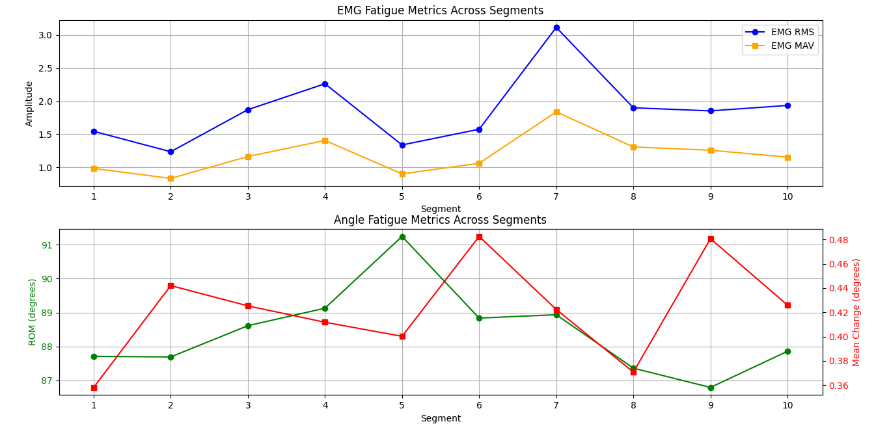

# analysis of leg extension exercise data

- This repository contains the script to analyse EMG recordings from vastus medialis and the knee angle associated with the movement. 
Data was collected from a subject performing 10 leg extensions while seated over 6 sessions. 

- The ```Data``` directory was obfuscated in the repository to ensure privacy.

- There are five tasks to complete this exercise. We will be analysing Session 0 (ID01_angle_0.mot and ID01_emg_0.sto)

**It is important to point out**
- The header states, "Units are S.I. units (seconds, meters, Newtons, ...)," meaning the EMG data would be in Volts. The exercise will consider it as such.
- At first glance, the EMG signal appears to be already filtered, however, all processing steps will still be performed.

## Part 1: Loading and plotting the data
The data was loaded using numpy ```loadtext``` method. Figures were created using ```matplotlib.pyplot```.
EMG signal (left) and knee joint angle (right) are shown in the figures below.


<p float="center">
  
   
</p>

- Questions:
    - *Do the timestamps differ between the files?*
    Yes, the increment in time is 0.010101s for the knee angle data, while it is 0.001000s for the emg data. Therefore there are differences in timestamps.


## Part 2: Understanding the data
For this task both data sets were plotted on the same graph as seen in the image below
<p float="center">
   
</p>

- Questions:
	- *Write a brief explanation of what the data represents.*
    The EMG data represents the eletric potential in volts captured by surface electrodes aplied at the vastus medialis region. The angle data represents the knee joint angle in degrees.

    - *Explain the expected relationships between the EMG signal, knee angle, and muscle fatigue*
    When plotting both data sets in the same graph it is possible to visualize that the rise on EMG signal relates to a downfall on the knee joint angle. That means that the muscle contraction that causes leg extension (knee angle from 90° to 0°) produces an eletric signal, captured by the surface electrodes.
    The relationship between fatigue and EMG shown in the graph is a rise on mean potential value when eletric potential is measured on the skin.

## Part 3: Preprocessing the raw EMG
Due to the low amplitude on the EMG signal noise becomes highly relevant, therefore filtering in necessary.
- EMG filtering was done in three steps

  1. Butterworth band-pass:
    A second order butterworth filter ranging from 10 Hz to 500 Hz was chosen for this step. Low frequencies are associated with the limb movement artifacts while frequencies above 450Hz are usually associated with eletronic noise. The image below show the first phase of processing.  
      <p float="center">
       
      </p>

  2. Rectifing:
      The absolute value of each point is taken, making the whole signal positive, as seen below.
      <p float="center">
       
      </p>

  3. Smoothing:
    Lastly, the signal is smoothed so it is easier to analyse its trend. The time constant chosen was 100ms for a good balance between smoothing and little delay effect. The final step is shown in the next figure
      <p float="center">
       
      </p>

- Data Comparison:
  It is possible to see in the image below that the filtered and raw signals are very similar. This corroborates the hypothesis that the original signal has already been filtered.
      <p float="center">
       
      </p>


- Questions:
  - *Why is filtering important for EMG data?*
    Due to low-amplitude voltages generated by muscle activation data acquisition process is highly susceptible to noise from various sources, such as power line interference, motion artifacts, and cross-talk from adjacent muscles. Filtering aims to mitigate the effects of frequencies unrelated to muscle activation.
  - *What effect does rectification have on the signal?*
    When trying to calculate common metrics such as average amplitude or total signal energy on raw emg data the results are close to zero, due to the signal oscillatory nature. By rectifying the signal, these parameters can be used to acquire meaninful results. 

  - *How does smoothing help interpret the data?*
    Smoothing makes easier to visualize trends in data. This is particularly valuable for analyzing muscle activation patterns and fatigue progression, as it allows for clearer identification of variations in signal intensity over time.


## Part 4: Calculating fatigue metrics
Fatigue metrics are displayed in the graph below.
      <p float="center">
       
      </p>
- Questions:
  - **How do RMS or MAV help assess fatigue in the muscle?**
  These parameters provide insights into muscle activation levels. As a muscle fatigues, its electrical activity typically increases when measured by surface electrodes.

  - **What metrics might suggest a decline in performance due to fatigue?**
  Other metrics tha suggest muscle fatigue are:
  Mean frequency descrease: A shift towards lower frequencies in the EMG power spectrum suggests a transition from fast-twitch to slow-twitch fiber activation.
  Reduction in range of motion: A decline in (ROM) may indicate reduced force production due to fatigue.
  Increase in muscle response time for contraction.


## References:
- Konrad, P. (2005). *The ABC of EMG: A Practical Introduction to Kinesiological Electromyography*.
- Pinto Neto, O., & Christou, E. A. (2010). Rectification of the EMG signal impairs the identification of oscillatory input to the muscle. *Journal of Neurophysiology, 103*
